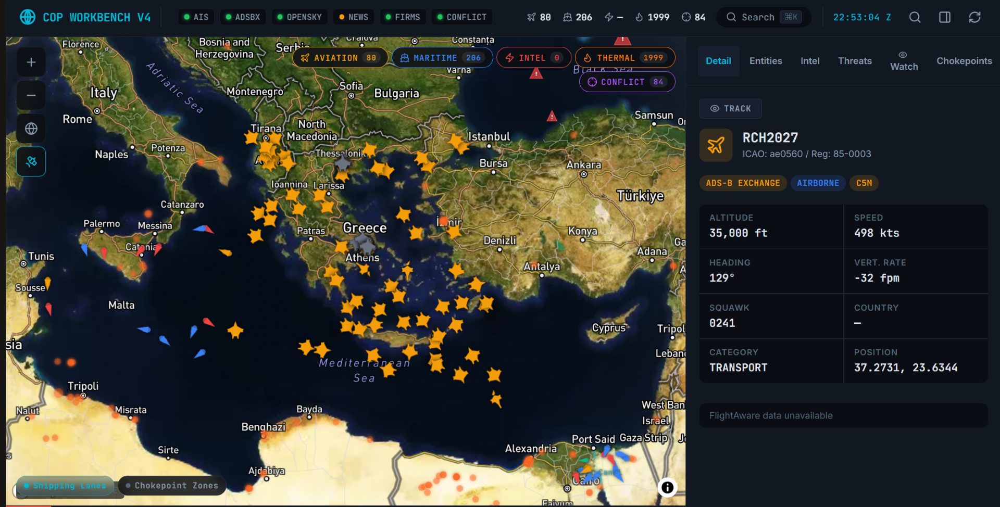
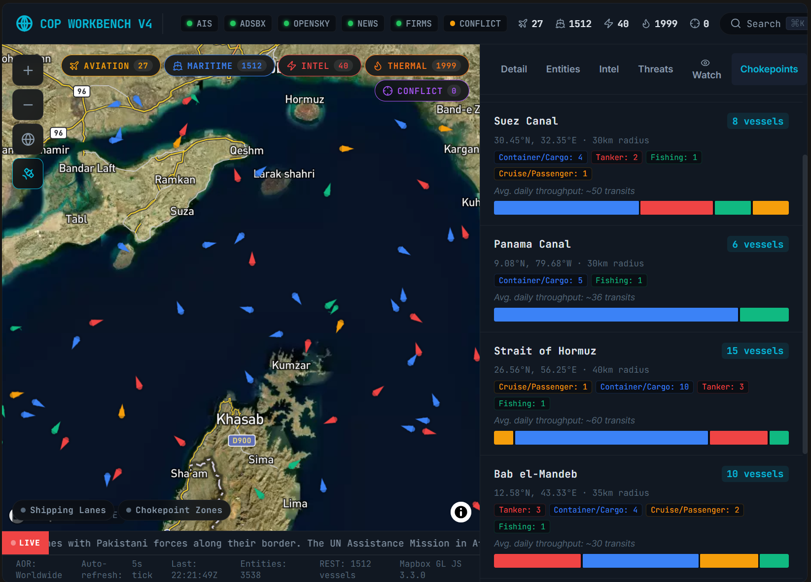

# Satellite Challenge

Satellite Challenge is a map-based dashboard for tracking ships and aircraft, replaying recent activity, and reviewing individual entities in context.
It pairs a TypeScript API with a React client, so a reviewer can see the ingest pipeline, the shared contracts, and the operator surface in one repo.




## What It Does

- pulls maritime and aviation feeds into one API
- normalizes live data into shared types the web app can consume
- shows tracks on a tactical map with side-panel detail
- supports replay so an operator can scrub recent activity instead of only watching the live feed

## How It Works

- `apps/api`: Express API, feed polling, replay buffer, normalization, and enrichment
- `apps/web`: React map UI, entity panel, status bar, and replay controls
- `packages/shared-types`: contracts shared by the API and the web app

## Run Locally

Copy `.env.example` to `.env` and fill in the providers you want to use:

- `MAPBOX_ACCESS_TOKEN`
- `AISSTREAM_API_KEY`
- `FLIGHTAWARE_API_KEY`
- optional `OPENSKY_USERNAME`
- optional `OPENSKY_PASSWORD`

```bash
npm install
npm run dev
```

- API: `http://localhost:4000`
- Web: `http://localhost:5173`

## Test

```bash
npm test
npm run test:e2e -w @sat/web
```

## What To Look At First

1. Open the web app and inspect the replay controls and entity detail flow.
2. Read [docs/architecture.md](docs/architecture.md) for the ingest and replay design.
3. Review [docs/landing.md](docs/landing.md) for a quick walkthrough of the screenshots.

## Project Background

This public repo is the cleaned-up version of a larger challenge workspace. Earlier experiments and secret-bearing files were removed so the repo shows the strongest implementation path instead of the full scratch history.

See [docs/landing.md](docs/landing.md) and [docs/publishing-notes.md](docs/publishing-notes.md) for more context.
