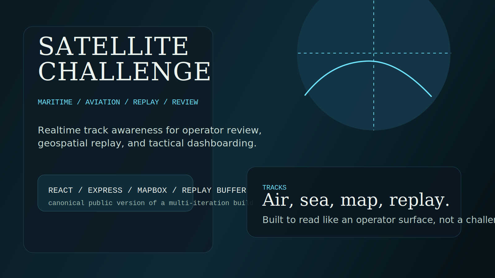
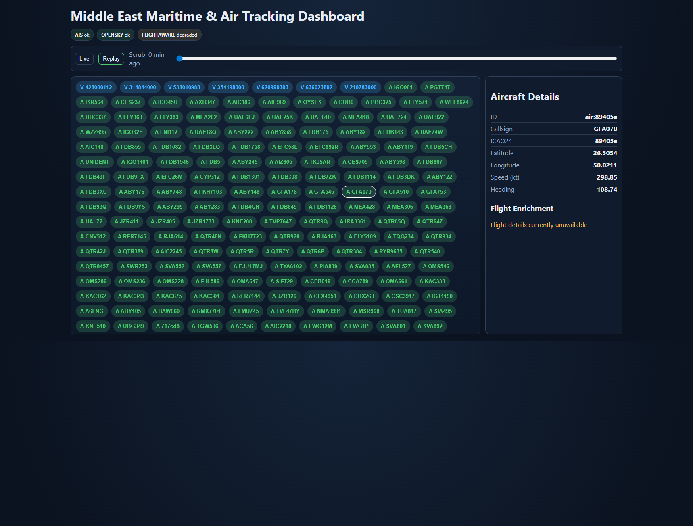
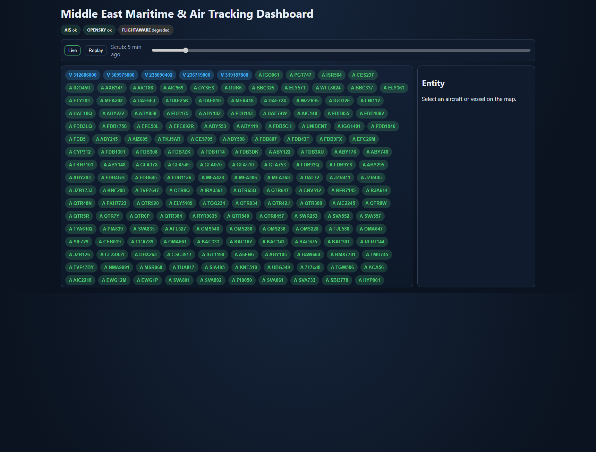

# Satellite Challenge Landing

## What This Is

Satellite Challenge is a realtime maritime and air tracking dashboard built around geospatial awareness, replay, and operator review.

## Who It Is For

This repo is for reviewers looking for a defense-adjacent interface case study: live tracks, replay controls, entity review, and a clear split between UI and aggregation layers.

## Why This Exists

The original challenge work lived across multiple iterations. This repo exists to present the strongest version in a public-safe form: one API, one web interface, one shared-types package, and a cleaner narrative about what the system does well.

## Screenshot Walkthrough

The main dashboard demonstrates tactical density without losing navigability.

The map view shows the repo's core promise: entity tracking in geographic context, with a surface designed for review rather than casual browsing.

## Quick Evaluation

1. Read the top-level [README.md](../README.md) for the fast path.
2. Inspect `apps/api` for ingestion and replay behavior.
3. Inspect `apps/web` for the operator surface and map-state decisions.

## Repo Signals

- public-safe canonical version of a multi-iteration project
- screenshot evidence in the repo root
- clean environment variable story
- tactical framing instead of challenge-dump presentation
